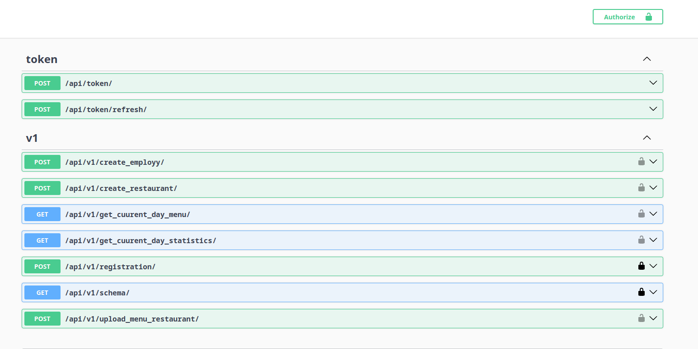

# Django DRF Project

Test project with functionality: jwt authorization, registration, creating restaurant, creating restaurant staff, creating menu for restaurant, getting menub of current day

### Installation and Running

These instructions will help you run the project.




## Requirements

Ensure you have the following software installed:

- [Docker](https://www.docker.com/get-started)
- [Docker Compose](https://docs.docker.com/compose/install/)
- [GNU Make](https://www.gnu.org/software/make/)

___
## Installation

1. **Clone the repository:**
   ```bash
   git clone https://github.com/podrivnick/test-inforce
   cd test-inforce
   ```
2. Set up environment variables:
   - Create a `.env` file and fill it according to `.env.example`.

### Implemented Commands

* `make app` - up application and database/infrastructure, with replication database
* `make app-logs` - follow the logs in app container
* `make app-down` - down application and all infrastructure
* `make collectstatic` - collect all static files, for example: django admin panel
* `make migrate` - apply all made migrations
* `make createsuperuser` - run command createsuperuser

### Specific Commands

* `make storage` - up only storages. you should run your application locally for debugging/developing purposes
* `make appbash` - enter into application container
* `make runtest` - run tests for main application

___

## Technology
+ **Django**
+ **Python**
+ **Docker**
+ **Punq**

___
## Design Patterns
+ **Factory Method**
+ **Repository**
+ **Dependency Injection**: (punq)
+ **Configuration Management** (dotenv)
+ **CQRS**

## Author
Author of the project: ***Rybakov Artem***
